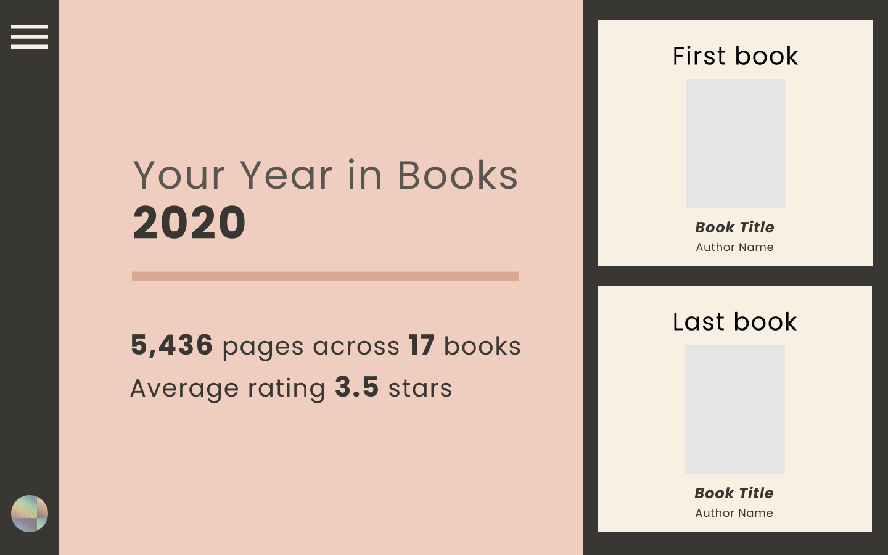

# year-in-books-upgraded (Frontend)
a redesign of Goodreads' Year in Books using the Goodreads API

the backend is stored in [this repo](https://github.com/emilywritescode/year-in-books-upgraded-backend/tree/main)

### Design concept

